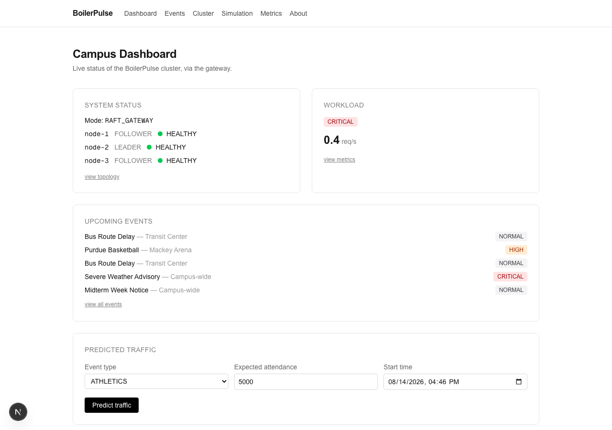
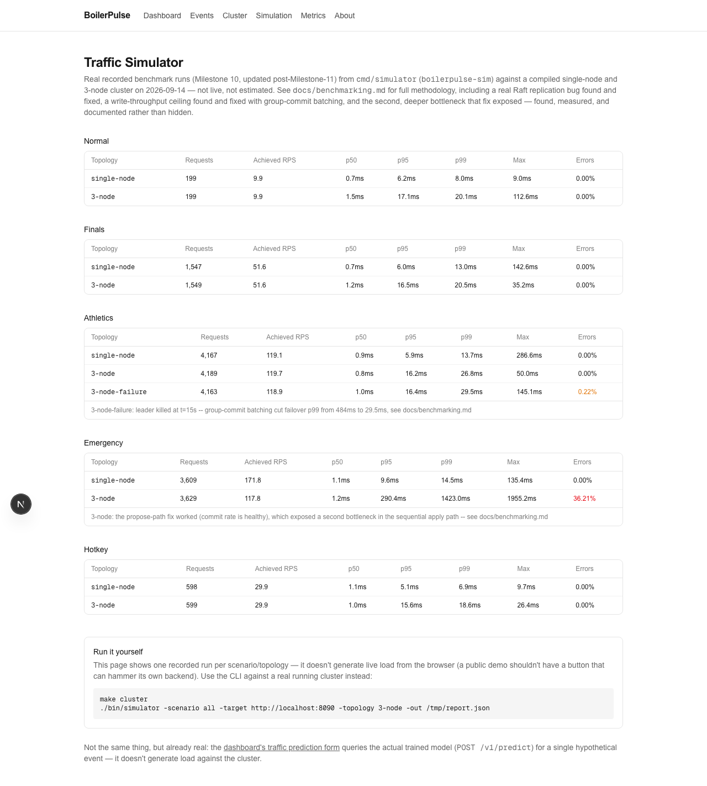
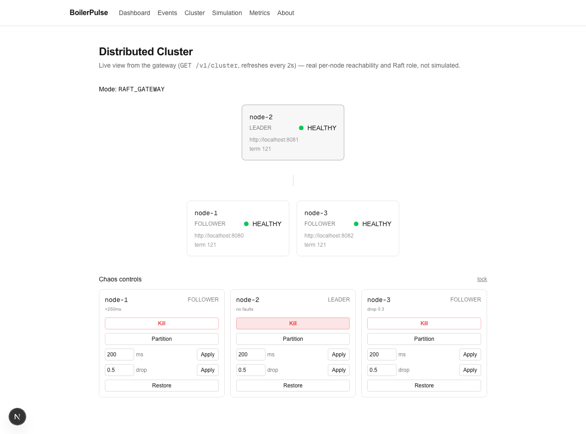
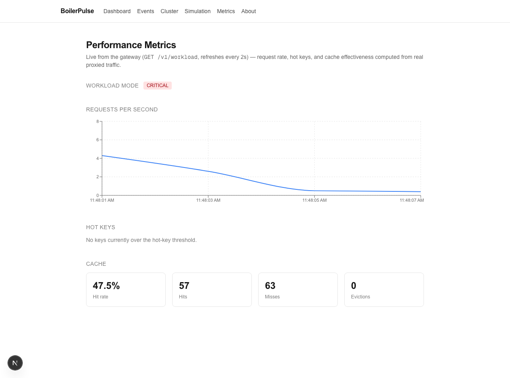

# BoilerPulse

**A distributed key-value store, built from scratch — hand-rolled Raft consensus, a custom LSM storage engine, and a real gateway — stress-tested with a campus-events workload and chaos-engineered against itself.**

The campus theme is the excuse; the distributed system is the point. Nothing here wraps etcd, Redis, or Postgres — the consensus algorithm, the on-disk storage format, and the write-ahead log are all implemented from the paper up, in Go, with 246 tests and a near 1:1 test-to-implementation-code ratio backing them.



## Why this is worth a second look

Most portfolio projects are CRUD apps with a deploy button. This one is a real distributed systems implementation that was load-tested and chaos-tested hard enough to find genuine bugs in itself — and the fixes, the regression tests, and the honest writeups of what *wasn't* fixed are all still in the repo. A few examples:

- **A real Raft concurrency bug, found by actually generating load.** Running the benchmark suite against a live cluster reliably destabilized a healthy leader — elections firing every second for no real reason. The cause: concurrent writes spawned one goroutine (and one `AppendEntries` RPC) *per peer per proposal*, with no serialization, flooding peers badly enough to starve the leader's own heartbeats. Fixed by serializing replication per peer through a coalescing trigger channel, with a deterministic regression test that fires 50 concurrent proposals at a blocked transport and asserts they collapse into ~1-5 real RPCs, not 50. See [`internal/raft/replication.go`](internal/raft/replication.go).
- **A write-throughput ceiling, fixed — which promptly uncovered a second one.** The 3-node cluster was degrading to a 38% error rate at ~80 sustained writes/sec because the WAL fsynced on every write while holding the node's one mutex, serializing every concurrent proposal through one lock and one disk barrier. Fixed with group-commit batching (concurrent writers share one fsync, proven by tests that count actual fsync calls, not just end-state correctness) — which fixed three of four affected benchmark scenarios outright and cut a live failover's p99 from 484ms to 29.5ms. The fourth (the most extreme, highest-write scenario) didn't improve: fixing the write path increased the commit rate enough to expose a second, previously-hidden bottleneck in the sequential state-machine apply path, caught live via a new Prometheus `apply_lag` metric. That one is measured, explained, and left as documented future work, the same honest way the first one was. See [`docs/benchmarking.md`](docs/benchmarking.md).
- **A CORS bug that only a real browser could catch — twice.** `curl` doesn't enforce CORS, so two separate bugs shipped past extensive backend testing and were only caught by actually driving the frontend in a headless browser: missing `Access-Control-Allow-Origin` entirely, and later, a proxy layer that copied a node's CORS headers on top of the gateway's own, duplicating every `Access-Control-*` header and making browsers reject the response outright.
- **Crash safety that's actually tested, not assumed.** Torn WAL writes, torn Raft-log writes, checksum corruption, crash-after-flush-before-reset — each has an explicit test that corrupts real bytes on disk and verifies recovery, not just a "should be fine" comment.

Full list of what was found and fixed, milestone by milestone, is in [`docs/roadmap.md`](docs/roadmap.md).

## Real, measured performance — not invented numbers

`cmd/simulator` generates real HTTP load against a compiled cluster and reports what actually happened. Every number below is from an actual run (`benchmarks/results/`), not an estimate:

| Scenario | Topology | Achieved RPS | p99 latency | Errors |
|---|---|---|---|---|
| Finals week (sustained, moderate load) | 3-node | 51.6 | 20.5ms | 0% |
| Home game (peak 150 rps) | 3-node | 119.7 | 26.8ms | 0% |
| **Leader killed mid-run** | 3-node | 118.9 | 29.5ms | 0.22% |
| Emergency alert (peak 200 rps, write-heavy) | 3-node | 117.8 | **1423ms** | **36.2%** |
| Emergency alert (same load) | single-node | 171.8 | 14.5ms | 0% |

That last pair is still the real cost of consensus made visible — but it's a different bottleneck than it used to be. A group-commit fix (batching concurrent writes into shared fsyncs, see below) fixed the original write-throughput ceiling well enough that the other four rows above all improved (the failover row's p99 dropped from 484ms to 29.5ms). Fixing it also increased the commit rate enough to expose a second, deeper bottleneck in the sequential apply path, which the emergency row still hits — found, measured, and documented, not swept under the rug. Full methodology in [`docs/benchmarking.md`](docs/benchmarking.md), or see it rendered on the app's own `/simulation` page:



## Chaos engineering, live

Every node runs a token-gated admin server that can kill itself, add real network latency, drop packets, or partition itself from the rest of the cluster — driven by a CLI (`scripts/chaos.sh`), the gateway's admin proxy, or live controls on the dashboard. This isn't a simulated failure indicator; it's real fault injection at the gRPC transport layer, and the topology view updates in real time as Raft actually re-elects a leader.



`tests/failure` automates the four scenarios that matter for a consensus system: kill a follower (stays available), kill the leader (elects a successor), kill 2 of 3 nodes (quorum lost, writes correctly rejected, no split brain), and restart the old leader (rejoins, catches up, never overwrites committed data) — all against a real cluster, not mocks.

## What's actually running under the hood



- **Storage** (`internal/storage/lsm`): a real LSM-tree — checksummed write-ahead log with torn-write-safe replay, memtables, SSTables with an atomic crash-safe flush protocol (temp file → fsync → rename → fsync directory → reset WAL), and compaction.
- **Consensus** (`internal/raft`): leader election with randomized timeouts, log replication, the §5.4.2 current-term-only commit rule, log-conflict resolution, crash-safe persistence of term/vote/log — tested against a fast in-memory fake network for the algorithm itself, and against real gRPC over localhost for the transport.
- **Gateway** (`internal/gateway`): finds the leader, routes writes to it with automatic retry-on-stale-leader, distributes reads with failover, rate-limits per client IP, caches (never for CRITICAL-consistency data), and reports a cluster-wide view no single node can see on its own.
- **Workload adaptation** (`internal/workload`, `internal/cache`): a live NORMAL→ELEVATED→HIGH_TRAFFIC→CRITICAL mode driven by real traffic and explicit event urgency, and an LRU cache that's aware of it.
- **Prediction** (`internal/prediction`): multiple linear regression trained from scratch via batch gradient descent on documented synthetic data — validated to actually beat a mean-only baseline, not just wired up.
- **Frontend** (`frontend/`): Next.js dashboard where every page — cluster topology, live metrics, event feed, chaos controls, benchmark results — reads real backend data. Verified in an actual headless browser repeatedly through the project's life, which is exactly how the CORS bugs above got caught.

## Architecture

```
   frontend / curl
         │
         ▼
  ┌──────────────────┐  routes writes to the leader, distributes reads,
  │  cmd/gateway     │  rate-limits, caches, tracks workload, predicts
  │  internal/gateway│
  └────────┬─────────┘
           │ HTTP
           ▼
  ┌───────────────────────┐        gRPC (RequestVote/AppendEntries)
  │  cmd/node              │◄───────────────────────────────┐
  │  ┌──────────────────┐  │                                 │
  │  │ internal/api     │  │   PUT/GET/DELETE /v1/kv/{key}   │
  │  │  Proposer? ───┐  │  │   GET /v1/cluster, GET /healthz │
  │  └───────────────┼──┘  │                                 ▼
  │                  ▼     │                        ┌───────────────────┐
  │  ┌──────────────────┐  │                        │  cmd/node (peer)  │
  │  │ internal/raft    │  │◄──────────────────────► │  ...same shape    │
  │  │  Node: election, │  │      gRPC               └───────────────────┘
  │  │  replication     │  │
  │  └────────┬─────────┘  │
  │           │ commit+apply
  │           ▼             │
  │  ┌──────────────────┐  │
  │  │ internal/storage │  │
  │  │  /lsm.Engine     │  │   memtable + WAL + SSTables
  │  └──────────────────┘  │
  └───────────────────────┘
  <data_dir>/wal.log, <data_dir>/sstables/*.sst, <data_dir>/raft/raft-log.bin
```

A separate `internal/admin` server per node (not pictured) handles chaos/failure injection on its own port, gated by a shared bearer token — see [`docs/failure-testing.md`](docs/failure-testing.md).

See [`docs/architecture.md`](docs/architecture.md) for the full picture, [`docs/gateway.md`](docs/gateway.md) for the gateway, [`docs/raft.md`](docs/raft.md) for the consensus design, and [`docs/storage-engine.md`](docs/storage-engine.md) for the on-disk format and crash-safety protocol.

## Tech stack

- **Backend**: Go, standard library `net/http` (no router dependency), `log/slog` structured JSON logs.
- **Frontend**: Next.js (App Router) + TypeScript + Tailwind CSS + Recharts — every page wired to real gateway data, browser-verified.
- **Storage**: custom WAL + memtable + SSTable engine, no external database.
- **Consensus**: hand-rolled Raft over a real gRPC transport (`pkg/protocol/raft.proto`) — not etcd, not a wrapper around one.
- **Chaos engineering**: per-node fault injection (kill/latency/packet-drop/partition) at the transport layer, a CLI, and live dashboard controls.
- **Benchmarking**: a real HTTP load generator with named traffic-curve scenarios, reporting measured throughput/latency/error-rate.
- **Observability**: Prometheus metrics (`GET /metrics` on every node and the gateway) — HTTP request rate/latency by route, live Raft state (term, leader, commit/apply lag), storage internals (memtable size, SSTable count), cache hit rate, and workload mode.
- **CI**: GitHub Actions — gofmt, vet, test, race, frontend lint/build, Docker build checks.

## Quick start

Requires Go 1.25+ and Node 20+.

```bash
# 3-node Raft cluster + gateway + event ingestion
make cluster
scripts/chaos.sh status                          # chaos/failure injection
./bin/simulator -scenario all -target http://localhost:8090 -topology 3-node -out /tmp/report.json  # benchmark
make stop

# Frontend (separate terminal)
make frontend    # npm install && npm run dev, on :3000
```

```bash
curl -X PUT localhost:8090/v1/kv/event:mackey \
  -d '{"value":{"title":"Purdue Basketball","location":"Mackey Arena"},"consistency":"EVENTUAL","ttl_seconds":3600}'

curl localhost:8090/v1/cluster
# {"mode":"RAFT_GATEWAY","leader_id":"node-2","nodes":[...,"role":"LEADER","term":1,...]}

scripts/chaos.sh kill node-2      # kill the leader
curl localhost:8090/v1/cluster    # a new leader is already elected
```

Full walkthroughs (including killing the leader and watching failover) in [`docs/raft.md`](docs/raft.md) and [`docs/gateway.md`](docs/gateway.md). `docker-compose.yml` + `deploy/docker/*.Dockerfile` run the same topology in containers; see [`docs/deployment.md`](docs/deployment.md) for what's hardened and what a real public deployment still needs.

## Testing

```bash
make test   # unit + integration
make race   # race detector — everything is clean under it
make lint   # gofmt + go vet
```

246 test functions across the Go backend (~7,400 lines of test code against ~8,000 lines of implementation) plus frontend typecheck/lint — including explicit crash-recovery tests (torn WAL/Raft-log writes, checksum corruption), Raft algorithm tests against a fast in-memory fake network, real-gRPC-over-localhost tests, full multi-node cluster integration tests, and `tests/failure`'s four chaos scenarios against a real cluster. Several of the bugs described above were caught specifically *because* of this — a fake-network test wouldn't have reproduced the replication flood, and no amount of `curl` would have caught either CORS bug.

## Documentation

Every subsystem has a doc explaining the design *and* what's simplified — nothing here claims to be more finished than it is:

[`architecture`](docs/architecture.md) · [`raft`](docs/raft.md) · [`storage-engine`](docs/storage-engine.md) · [`gateway`](docs/gateway.md) · [`event-ingestion`](docs/event-ingestion.md) · [`workload-model`](docs/workload-model.md) · [`prediction`](docs/prediction.md) · [`frontend`](docs/frontend.md) · [`failure-testing`](docs/failure-testing.md) · [`benchmarking`](docs/benchmarking.md) · [`observability`](docs/observability.md) · [`deployment`](docs/deployment.md) · [`roadmap`](docs/roadmap.md)

## License

MIT — see [`LICENSE`](LICENSE).
